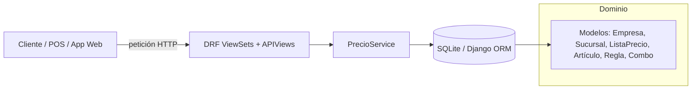

# Motor de Gestión de Precios 🧮

<div align="center">
  <span style="background:#2E86C1;color:#fff;padding:4px 12px;border-radius:999px;font-size:0.9rem;">Django 5.2 · DRF 3.16 · SQLite</span>
  <span style="background:#27AE60;color:#fff;padding:4px 12px;border-radius:999px;font-size:0.9rem;">API REST</span>
  <span style="background:#D35400;color:#fff;padding:4px 12px;border-radius:999px;font-size:0.9rem;">Motor de reglas</span>
</div>

---

## 1. ¿Qué hace este proyecto?

Es un **motor centralizado para gestionar precios comerciales** de una empresa multicanal. Permite:
- Definir empresas, sucursales y catálogos de productos.
- Crear **listas de precios** por canal (E-commerce, Tienda, etc.) con vigencias controladas.
- Configurar **reglas inteligentes** (por porcentaje, montos fijos, combinaciones y validaciones por volumen o monto de pedido).
- Calcular el **precio final autorizado** de un artículo en tiempo real, respetando costos mínimos y reglas de prioridad.

Todo está expuesto vía API REST para integrarse con e-commerce, POS o ERPs.

---

## 2. Vista rápida de la arquitectura



- **`core/`**: configuración base de Django y ruteo a la API (`core/urls.py`).
- **`gestion_precios/`**: app principal con modelos, vistas, servicios, serializadores y un comando de datos demo.
- **`PrecioService`** (`gestion_precios/services.py`): cerebro que decide qué lista aplicar, qué reglas disparar y valida venta bajo costo.

---

## 3. Modelos principales

| Capa | Modelo | Descripción | Archivo |
|------|--------|-------------|---------|
| Organización | `Empresa`, `Sucursal` | Contexto multiempresa/multisucursal. | `gestion_precios/models.py` |
| Catálogo | `LineaArticulo`, `GrupoArticulo`, `Articulo` | Agrupa SKUs y guarda costos, usado por reglas. | `gestion_precios/models.py` |
| Pricing | `ListaPrecio`, `PrecioArticulo` | Lista con vigencias + precios base por artículo. | `gestion_precios/models.py` |
| Reglas | `ReglaPrecio` | Define descuentos por porcentaje/monto, condiciones y prioridad. | `gestion_precios/models.py` |
| Promos | `CombinacionProducto` | Combinaciones tipo “compra A+B y gana…”. | `gestion_precios/models.py` |

> Las relaciones y validaciones clave (unicidad por lista/artículo, prioridad de reglas y autorización de venta bajo costo) viven en los `ModelViewSet` + serializadores de DRF (`gestion_precios/serializers.py`).

---

## 4. Cómo se calcula un precio

1. **Selección de lista vigente** (`PrecioService.obtener_lista_vigente`):
   - Filtra por empresa, estado activo y fechas de vigencia.
   - Prioriza lista más específica: sucursal + canal → sucursal + TODOS → empresa + canal → empresa + TODOS.
2. **Precio base**:
   - Busca `PrecioArticulo` correspondiente al SKU dentro de la lista.
3. **Motor de reglas** (`PrecioService.calcular_precio_final`):
   - Ejecuta reglas por prioridad (campo `prioridad`, menor = más urgente).
   - Soporta condiciones por cantidad, monto total o presencia de combinaciones en el carrito (`cart_items`).
   - Registra si alguna regla permite vender por debajo del costo.
4. **Validación de costo**:
   - Si el precio final < `ultimo_costo` y ninguna regla lo autorizó, se ajusta automáticamente al costo y se informa en la respuesta.
5. **Respuesta JSON**:
   - Lista aplicada, precio base, precio final unitario, total (precio final ✕ cantidad), reglas disparadas y flag `autorizado_bajo_costo`.

---

## 5. API expuesta (prefijo `/api/`)

| Método | Ruta | Descripción |
|--------|------|-------------|
| `GET` | `/api/calcular-precio/` | Calcula el precio final de un artículo según contexto y reglas. |
| `GET` | `/api/lista-vigente/` | Devuelve la lista de precios aplicable a un canal/sucursal. |
| CRUD | `/api/empresas/`, `/sucursales/`, `/articulos/`, `/lineas-articulo/`, `/grupos-articulo/` | Administración de catálogo base. |
| CRUD | `/api/listas-precio/`, `/precios-articulo/` | Gestión de listas y precios base. |
| CRUD | `/api/reglas-precio/`, `/combinaciones/` | Alta/baja/edición de reglas y combos promocionales. |

> Los endpoints CRUD provienen de los `ModelViewSet` registrados en `gestion_precios/urls.py`. El cálculo de precios usa las APIView `CalcularPrecioFinalAPIView` y `ObtenerListaVigenteAPIView`.

---

## 6. Ejemplos prácticos

### 6.1 Calcular precio de un carrito
```bash
curl -G http://127.0.0.1:8000/api/calcular-precio/ \
    --data-urlencode "empresa_id=1" \
    --data-urlencode "canal_venta=ECOMMERCE" \
    --data-urlencode "sucursal_id=1" \
    --data-urlencode "articulo_id=2" \
    --data-urlencode "cantidad=3" \
    --data-urlencode "monto_pedido=540.00" \
    --data-urlencode "cart_items=2,3"
```

**Qué muestra:**
- Lista aplicada, precio base y precio final resultante.
- Regla(s) activadas (por volumen, monto mínimo o combinación teclado+mouse).
- Si la venta fue autorizada bajo costo.

### 6.2 Consultar lista vigente
```bash
curl -G "http://127.0.0.1:8000/api/lista-vigente/?empresa_id=1&canal_venta=TIENDA&sucursal_id=2"
```
Devuelve los metadatos de la lista que se está usando para deducir precios en esa sucursal.

---

## 7. Puesta en marcha

> Requisitos: Python 3.12+, `pip`, entorno virtual recomendado.

```bash
# 1. Crear y activar entorno
python -m venv .venv
source .venv/bin/activate

# 2. Instalar dependencias
pip install -r requirements.txt

# 3. Aplicar migraciones
python manage.py migrate

# 4. (Opcional) Crear datos demo
python manage.py populate_data

# 5. Levantar el servidor
python manage.py runserver
```

- Panel de administración disponible en `http://127.0.0.1:8000/admin/` (crea un superusuario con `python manage.py createsuperuser`).
- La base por defecto es `db.sqlite3` en el root del proyecto (`core/settings.py`).

---

## 8. Datos de ejemplo (`populate_data`)

El comando `python manage.py populate_data` crea:
- 1 empresa, 2 sucursales (Lima y Arequipa).
- 4 artículos (Laptop, Mouse, Teclado, Silla) con sus líneas/grupos.
- 2 listas de precio (E-commerce Lima, Tienda Arequipa) + precios base.
- 5 reglas destacadas: descuentos porcentuales, monto fijo por volumen, regla global por monto y una combinación Teclado+Mouse.

Se limpia el catálogo antes de recargar datos para garantizar consistencia.

---

## 9. Checklist para exponer

1. **Contexto**: explicar que es un “motor de precios” multiempresa/multicanal.
2. **Modelo de datos**: mostrar la tabla anterior o el diagrama (Mermaid) destacando relaciones.
3. **Demo API**:
   - Ejecutar `populate_data`.
   - Mostrar `/api/listas-precio/` y `/api/reglas-precio/` desde browsable API.
   - Consumir `calcular-precio` con un cURL (ver sección 6.1) para evidenciar reglas y ajuste bajo costo.
4. **Reglas avanzadas**: enfatizar la combinación teclado+mouse y el control de autorización bajo costo.
5. **Siguientes pasos** (sugeridos): autenticación, UI para gestión de reglas, jobs para caducidad de listas.

---

## 10. Recursos clave para estudiar el código

| Archivo | Rol |
|---------|-----|
| `core/settings.py` | Configuración de Django y registro de apps. |
| `gestion_precios/models.py` | Modelo relacional completo y restricciones. |
| `gestion_precios/serializers.py` | Validaciones de negocio (solapamiento de vigencias, duplicidad de reglas). |
| `gestion_precios/services.py` | Algoritmo de cálculo y selección de listas. |
| `gestion_precios/views.py` | API REST (ViewSets + APIViews custom). |
| `gestion_precios/management/commands/populate_data.py` | Seeds para demos rápidas. |

---

<div align="center">
  <span style="color:#1ABC9C;font-weight:600;">Listo para producción →</span>
  añade autenticación, logging y despliegue a tu proveedor favorito.
</div>

---
---

# 11. Análisis Detallado del Código Fuente

Esta sección desglosa los archivos más importantes del proyecto para una comprensión profunda de su funcionamiento interno.

## 11.1. `core/settings.py`

Este es el archivo de configuración principal de Django.

- **`INSTALLED_APPS`**: Aquí se registran todas las "aplicaciones" que componen el proyecto.
    - `django.contrib...`: Apps estándar de Django para autenticación, etc.
    - **`'gestion_precios'`**: Le dice a Django que nuestra aplicación principal existe y debe ser considerada.
    - **`'rest_framework'`**: Activa el **Django REST Framework (DRF)**, la librería clave que usamos para construir la API REST.

- **`DATABASES`**: Configura la base de datos.
    - `'ENGINE': 'django.db.backends.sqlite3'`: Usa SQLite, una base de datos ligera basada en un solo archivo (`db.sqlite3`). Ideal para desarrollo y prototipos.
    - `'NAME': BASE_DIR / 'db.sqlite3'`: Especifica la ruta al archivo de la base de datos.

- **`ROOT_URLCONF = 'core.urls'`**: Establece que el archivo `core/urls.py` es el punto de entrada para resolver las URLs de todo el proyecto.

## 11.2. `core/urls.py`

Este archivo es el "router" principal del proyecto.

```python
from django.contrib import admin
from django.urls import path, include

urlpatterns = [
    path('admin/', admin.site.urls),
    # Le dice a Django que cualquier URL que empiece con 'api/'
    # debe ser manejada por el archivo de URLs de nuestra app 'gestion_precios'.
    path('api/', include('gestion_precios.urls')),
]
```
- **`path('api/', include('gestion_precios.urls'))`**: Esta es la línea más importante. Delega cualquier petición que comience con `/api/` al archivo `urls.py` dentro de la aplicación `gestion_precios`. Esto mantiene el código organizado.

## 11.3. `gestion_precios/models.py`

Aquí se define la estructura de la base de datos. Cada clase es una tabla.

- **`Empresa`, `Sucursal`, `LineaArticulo`, `GrupoArticulo`**: Son modelos simples que sirven como catálogo. Usan `CharField` para texto y `ForeignKey` para crear relaciones.
    - `on_delete=models.CASCADE`: Si se borra una `Empresa`, se borran en cascada todas sus `Sucursales`.
    - `unique_together`: En `Sucursal`, evita que haya dos sucursales con el mismo nombre dentro de la misma empresa.

- **`Articulo`**: Representa un producto.
    - `sku`: Código único del producto.
    - `ultimo_costo = models.DecimalField(...)`: Guarda el costo del producto. Es crucial para la validación de "venta bajo costo". `DecimalField` es usado para dinero para evitar errores de precisión de los números flotantes.

- **`ListaPrecio`**: El corazón del sistema.
    - `canal_venta`: Un `CharField` con `choices` para limitar las opciones a 'ECOMMERCE', 'TIENDA', etc.
    - `fecha_inicio_vigencia`, `fecha_fin_vigencia`: Campos de tipo `DateField` para controlar cuándo está activa esta lista. `null=True, blank=True` significa que la fecha de fin es opcional.

- **`CombinacionProducto`**: Agrupa artículos para promociones.
    - `articulos = models.ManyToManyField(Articulo, ...)`: Una relación "muchos a muchos". Una combinación puede tener muchos artículos, y un artículo puede estar en muchas combinaciones.

- **`PrecioArticulo`**: Asigna un precio base a un artículo dentro de una lista de precios específica.
    - `unique_together = ('lista_precio', 'articulo')`: Restricción clave. Asegura que un artículo solo puede tener **un** precio base dentro de la misma lista.

- **`ReglaPrecio`**: La definición de una regla de descuento o promoción.
    - `tipo_regla`, `condicion`: Campos con `choices` para definir si la regla es por `%` o monto fijo, y si se activa por cantidad mínima o monto mínimo.
    - `aplica_articulo`, `aplica_grupo`, `aplica_linea`, `aplica_combinacion`: `ForeignKey` opcionales que definen el alcance de la regla. Si todos son nulos, la regla es general.
    - **`prioridad = models.IntegerField(default=10, ...)`**: Campo numérico CRÍTICO. El motor de precios usará este número para decidir qué regla aplicar primero (un número más bajo significa mayor prioridad).
    - **`permite_venta_bajo_costo = models.BooleanField(default=False, ...)`**: Un simple booleano que actúa como un permiso explícito para que esta regla pueda dejar el precio final por debajo del `ultimo_costo` del artículo.
    - `class Meta: ordering = ['prioridad']`: Le dice a Django que, por defecto, cualquier consulta a `ReglaPrecio` debe devolver los resultados ordenados por el campo `prioridad`. Esto simplifica enormemente el código en el `PrecioService`.

## 11.4. `gestion_precios/urls.py`

Define las rutas específicas de la API.

```python
from rest_framework.routers import DefaultRouter
# ... importaciones de vistas ...

router = DefaultRouter()
router.register(r'empresas', EmpresaViewSet)
# ... más registros ...

urlpatterns = [
    path('calcular-precio/', CalcularPrecioFinalAPIView.as_view(), name='calcular-precio'),
    path('lista-vigente/', ObtenerListaVigenteAPIView.as_view(), name='lista-vigente'),
    path('', include(router.urls)),
]
```
- **`DefaultRouter`**: Una herramienta de DRF que genera automáticamente las URLs para operaciones CRUD (Crear, Leer, Actualizar, Borrar) para un `ViewSet`. Por ejemplo, para `router.register(r'articulos', ArticuloViewSet)`, crea:
    - `GET /api/articulos/`: Listar todos los artículos.
    - `POST /api/articulos/`: Crear un nuevo artículo.
    - `GET /api/articulos/{id}/`: Obtener un artículo específico.
    - `PUT /api/articulos/{id}/`: Actualizar un artículo.
    - `DELETE /api/articulos/{id}/`: Borrar un artículo.
- **`path(...)`**: Para las vistas que no son un CRUD estándar (como `CalcularPrecioFinalAPIView`), definimos la ruta manualmente. `.as_view()` es necesario para convertir la clase de la vista en una función que Django pueda usar.

## 11.5. `gestion_precios/views.py`

Maneja las peticiones HTTP, interactúa con los servicios y modelos, y devuelve una respuesta.

- **`ModelViewSet` (ej: `ArticuloViewSet`)**: Son clases de DRF que proveen la implementación completa para el CRUD. Solo necesitan saber dos cosas:
    - `queryset = Articulo.objects.all()`: Qué conjunto de datos deben manejar.
    - `serializer_class = ArticuloSerializer`: Qué serializador usar para convertir los datos a/desde JSON.

- **`APIView` (ej: `CalcularPrecioFinalAPIView`)**: Una clase más básica para cuando necesitas control total sobre la lógica.
    - `def get(self, request, *args, **kwargs)`: Define la lógica para peticiones `GET`.
    - `request.query_params.get('empresa_id')`: Así se leen los parámetros de la URL (ej: `?empresa_id=1`).
    - **Validación**: El código verifica que los parámetros existan y sean del tipo correcto (usando `try-except` para `int()` y `Decimal()`).
    - **Llamada al Servicio**: `resultado = PrecioService.calcular_precio_final(...)`. La vista no contiene la lógica de negocio; solo recopila datos y delega el trabajo al `PrecioService`.
    - **Respuesta**: `return Response(serializer.data, status=status.HTTP_200_OK)`. La vista usa un serializador (`ResultadoCalculoSerializer`) para formatear la respuesta y la devuelve con un código de estado HTTP.

## 11.6. `gestion_precios/serializers.py`

Actúan como "traductores" entre los modelos de Django (objetos Python complejos) y JSON (texto simple para la API). También son el lugar ideal para validaciones complejas.

- **`ModelSerializer`**: Al igual que los `ModelViewSet`, son una forma rápida de crear un serializador para un modelo. Con `class Meta: model = Articulo; fields = '__all__'`, se crean automáticamente los campos del serializador basados en los campos del modelo.

- **`validate(self, data)`**: Un método especial que DRF llama durante la validación.
    - En `ListaPrecioSerializer`, este método contiene una lógica compleja con objetos `Q` para construir consultas a la base de datos y verificar si una nueva lista de precios se solapa en fechas con otra ya existente para el mismo canal/sucursal. Si es así, lanza un `serializers.ValidationError`.
    - En `ReglaPrecioSerializer`, hace algo similar para evitar que se creen dos reglas idénticas.

- **`ResultadoCalculoSerializer`**: Es un `serializers.Serializer` simple (no de modelo). No está ligado a ningún modelo, solo define la estructura del JSON de respuesta del cálculo de precios. Actúa como un Contrato de Datos (DTO).

## 11.7. `gestion_precios/services.py`

**Este es el cerebro de la aplicación.** Contiene la lógica de negocio pura, sin tener conocimiento de HTTP.

- **`class PrecioService`**: Agrupa toda la lógica en una clase.
- **`@staticmethod`**: Un decorador que indica que el método pertenece a la clase, pero no necesita acceso a una instancia de la clase (`self`). Es una forma de organizar funciones relacionadas sin necesidad de crear un objeto.

- **`obtener_lista_vigente(...)`**:
    - **Tipado**: `empresa_id: int`, `-> ListaPrecio | None`. Esto es "type hinting". No obliga a nada, pero ayuda a los desarrolladores y herramientas a entender qué tipo de datos espera y devuelve la función.
    - **Lógica de cascada**: Implementa la jerarquía de búsqueda. Intenta encontrar la lista más específica primero (`sucursal_id` + `canal_venta`). Si no la encuentra, relaja los criterios (`sucursal_id` + 'TODOS'), y así sucesivamente. Este patrón de "fallbacks" es central para la flexibilidad del sistema.
    - **`Q(...)`**: Los objetos `Q` son herramientas de Django para construir consultas complejas con lógica `AND` (`&`) y `OR` (`|`).

- **`calcular_precio_final(...)`**: El método más complejo.
    1.  **Obtener Lista y Precio Base**: Llama a `obtener_lista_vigente` y luego busca el `PrecioArticulo` para obtener el precio inicial y el costo del artículo.
    2.  **Obtener Reglas**: `reglas = lista_vigente.reglas.all()`. Gracias al `ordering` en el `Meta` del modelo `ReglaPrecio`, esta lista ya viene ordenada por prioridad.
    3.  **Iterar sobre las Reglas**: Recorre cada regla en orden de prioridad.
    4.  **Verificar Aplicabilidad**:
        - **Combinación**: Revisa si la regla es de combinación y si todos los artículos necesarios están en el carrito (`cart_items_set`).
        - **Condición**: Si no es de combinación, verifica si se cumple la condición de `CANTIDAD_MINIMA` o `MONTO_MINIMO`.
    5.  **Aplicar Descuento**: Si la regla es aplicable, modifica el `precio_final` calculando el descuento (`PORCENTAJE` o `MONTO_FIJO`).
    6.  **Registrar Permiso**: `if regla.permite_venta_bajo_costo: permiso_venta_bajo_costo = True`. Guarda en una variable si *alguna* de las reglas aplicadas dio permiso para vender bajo costo.
    7.  **Validación Final de Costo**: Después de aplicar todas las reglas, compara el `precio_final` con el `ultimo_costo`. Si el precio es menor Y la variable `permiso_venta_bajo_costo` es `False`, ajusta el precio al costo.
    8.  **Devolver Resultado**: Construye y devuelve un diccionario con toda la información del cálculo.

## 11.8. `gestion_precios/management/commands/populate_data.py`

Un script para llenar la base de datos con datos de prueba.

- **`class Command(BaseCommand)`**: Estructura estándar para crear un nuevo comando de `manage.py`.
- **`@transaction.atomic`**: Un decorador muy importante. Envuelve toda la ejecución del método `handle` en una transacción de base de datos. Si cualquier parte del script falla (por ejemplo, una validación o un error de creación), **toda la operación se revierte (rollback)**, dejando la base de datos en el estado en que estaba antes de empezar. Esto garantiza la consistencia de los datos.
- **`handle(self, *args, **options)`**: El método principal que se ejecuta cuando llamas a `python manage.py populate_data`.
- **Lógica**:
    1.  Imprime mensajes en la consola con `self.stdout.write`.
    2.  Limpia los datos antiguos (`Articulo.objects.all().delete()`).
    3.  Crea instancias de los modelos en el orden correcto (primero `Empresa`, luego `Sucursal` que depende de `Empresa`, etc.).
    4.  Usa `Decimal('1500.00')` para crear valores monetarios.
    5.  Crea un conjunto de datos interconectados que permiten probar todas las características del sistema: reglas por artículo, por volumen, por monto, combinaciones y la validación de venta bajo costo.
